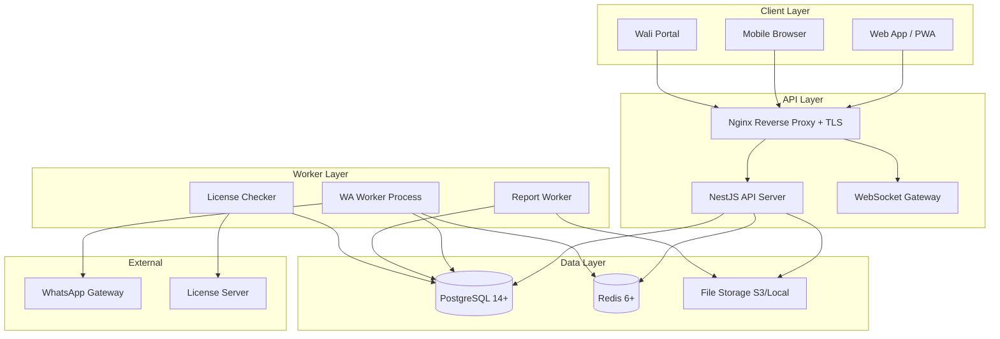
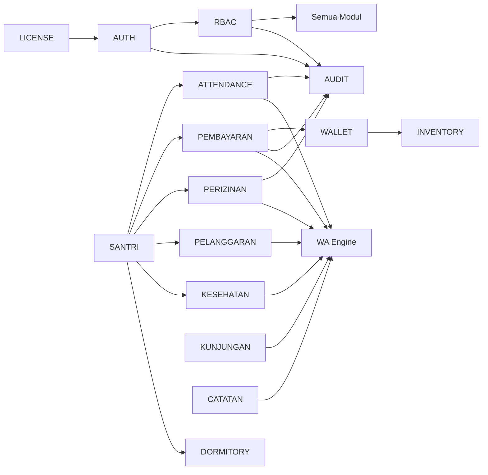
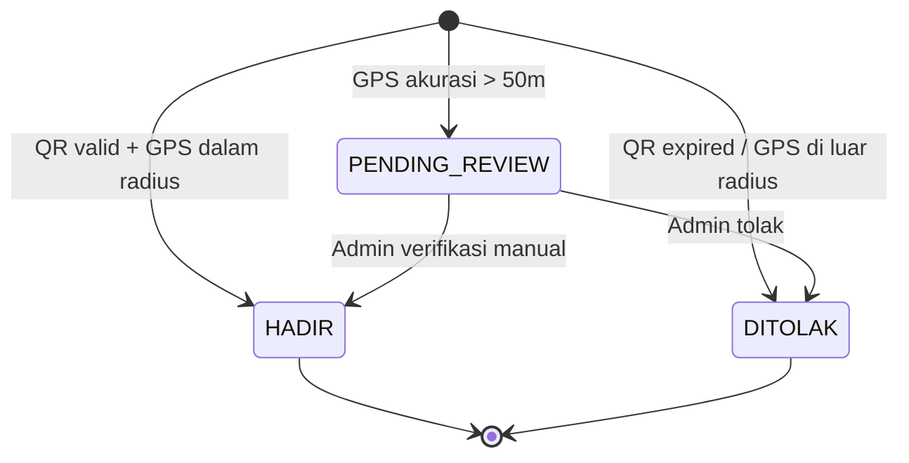
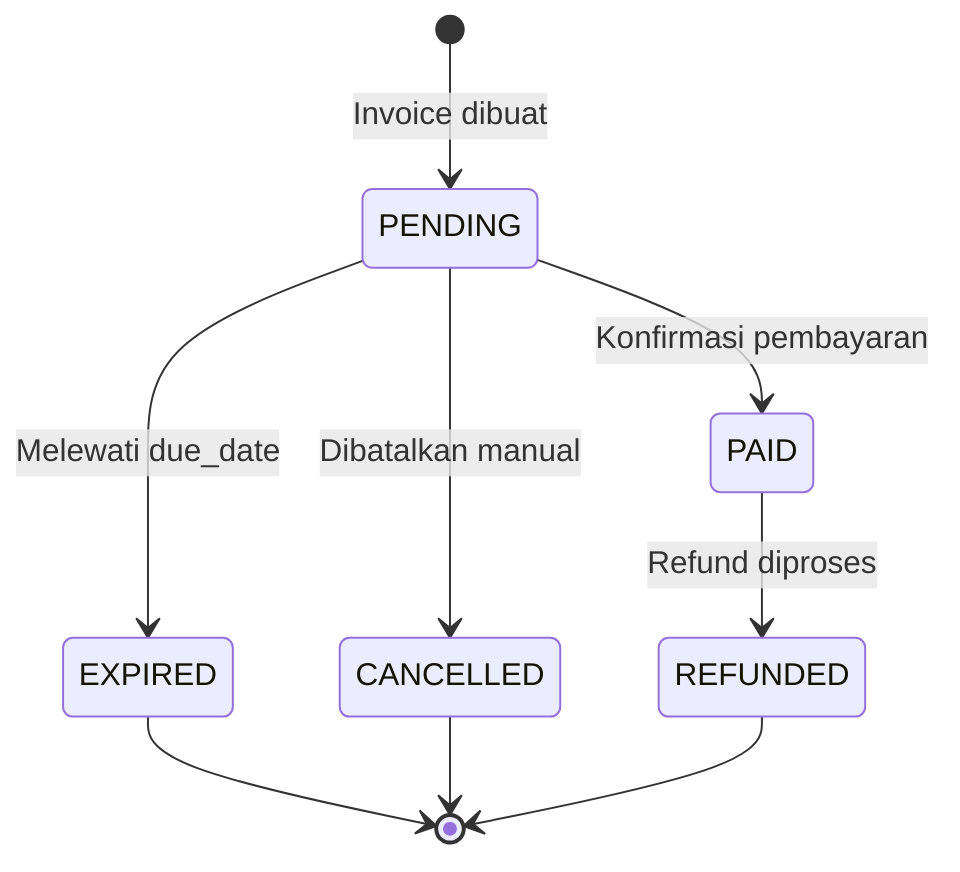
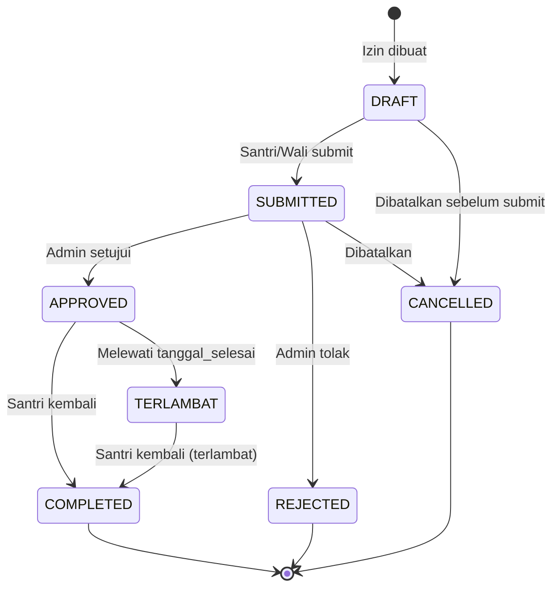
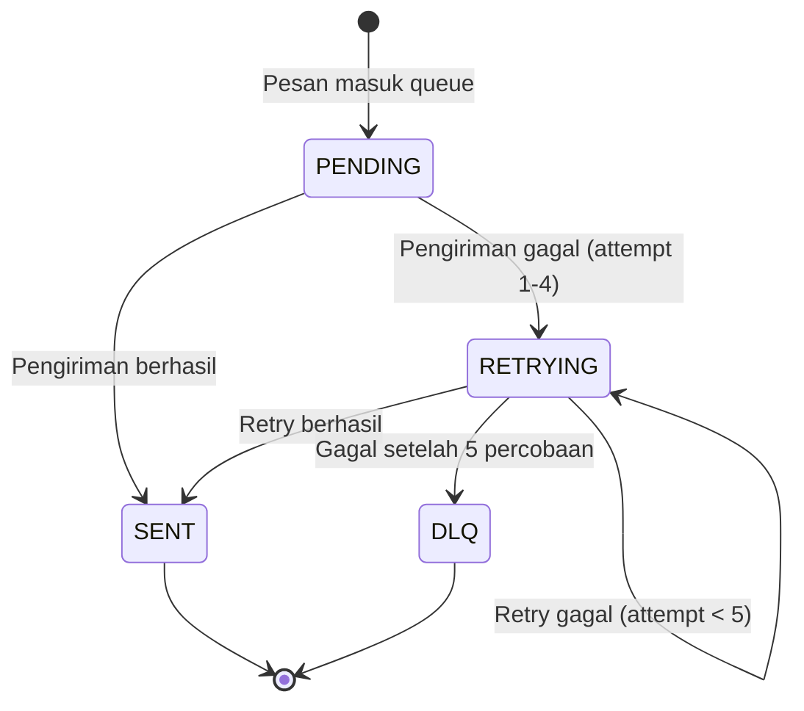
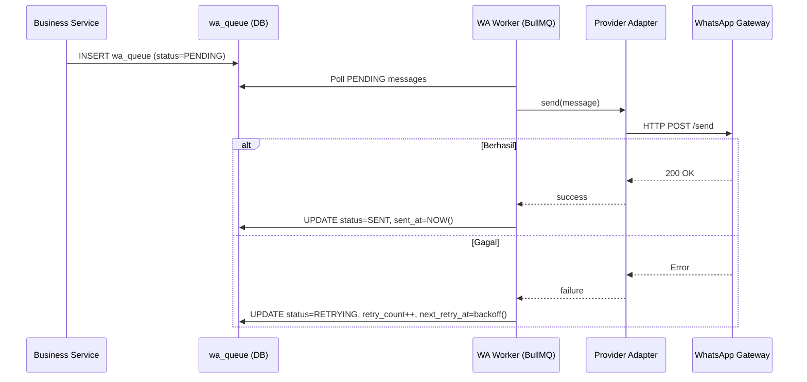
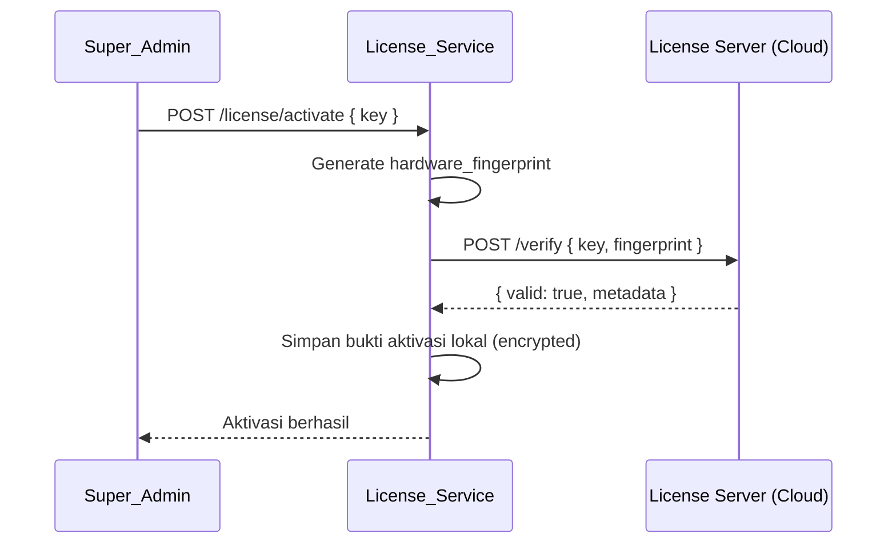
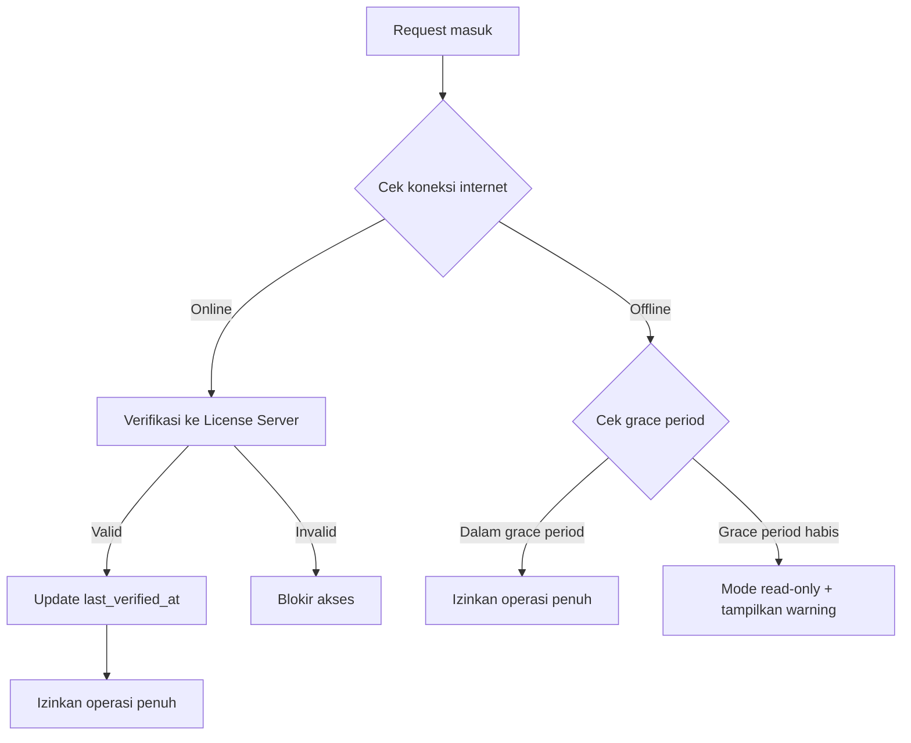

# Dokumen Desain
# Aplikasi Manajemen Pesantren Enterprise

## Ikhtisar

Aplikasi Manajemen Pesantren Enterprise adalah sistem manajemen level enterprise berbasis web yang dibangun di atas stack NestJS + TypeScript + PostgreSQL + Redis. Sistem ini bersifat single-tenant, perpetual license, dan dirancang untuk deployment on-premise atau VPS milik pelanggan.

Sistem mencakup 19 modul fungsional yang terintegrasi dalam satu platform: Auth/RBAC, Santri, PPDB, Akademik, Buku Penghubung, Pelanggaran, Kesehatan, Kunjungan, Presensi, Poin Reward, Keuangan/SPP, Top-Up Saldo, Koperasi, Perizinan, Asrama, Kepegawaian, E-ID Card, dan Laporan/Dashboard.

Prinsip desain utama:
- **Offline-first untuk operasi inti**: presensi, pembayaran, dan perizinan harus berfungsi tanpa koneksi internet eksternal
- **Immutable audit trail**: setiap aksi kritikal dicatat dan tidak dapat diubah
- **Asynchronous notification**: WhatsApp dikirim via queue untuk tidak memblokir operasi utama
- **Security by default**: HTTPS, RBAC, rate limiting, anti-replay pada semua endpoint sensitif


---

## Arsitektur Sistem

### Arsitektur High-Level



### Pola Arsitektur

Sistem menggunakan **Modular Monolith** dengan NestJS modules sebagai unit isolasi. Setiap modul fungsional memiliki controller, service, dan DTOs sendiri. Komunikasi antar modul dilakukan melalui service injection (bukan HTTP), kecuali untuk worker yang berkomunikasi via database queue.

**Alasan pemilihan Modular Monolith** (bukan microservices):
- Deployment on-premise dengan resource terbatas (2 vCPU, 4GB RAM)
- Menghindari kompleksitas network overhead antar service
- Memudahkan operasional tim kecil pesantren
- Tetap memungkinkan ekstraksi ke microservice di masa depan

### Komponen Utama

| Komponen | Teknologi | Tanggung Jawab |
|---|---|---|
| API Server | NestJS + TypeScript | Semua endpoint REST + WebSocket |
| Database | PostgreSQL 14+ | Penyimpanan data utama |
| Cache | Redis 6+ | Session, rate limit, QR token, queue |
| WA Worker | BullMQ + Node.js | Proses antrian notifikasi WhatsApp |
| Report Worker | BullMQ + Node.js | Generate PDF/Excel asinkron |
| File Storage | S3 / Local FS | Foto santri, dokumen, laporan |
| Reverse Proxy | Nginx | TLS termination, static files |


---

## Komponen dan Antarmuka

### Modul NestJS

```
src/
├── common/
│   ├── guards/          # JwtAuthGuard, RolesGuard, LicenseGuard
│   ├── interceptors/    # AuditLogInterceptor, LoggingInterceptor
│   ├── decorators/      # @CurrentUser, @Roles, @Public
│   ├── middleware/      # RateLimitMiddleware
│   └── prisma/          # PrismaService
├── modules/
│   ├── auth/            # Login, refresh, logout, JWT strategy
│   ├── rbac/            # Role, permission, matriks akses
│   ├── santri/          # Data santri dan wali santri
│   ├── ppdb/            # Penerimaan peserta didik baru
│   ├── academic/        # Kelas, mapel, jadwal, nilai
│   ├── catatan/         # Buku penghubung digital
│   ├── pelanggaran/     # Pelanggaran dan poin reward
│   ├── kesehatan/       # Rekam medis dan kunjungan klinik
│   ├── kunjungan/       # Kunjungan tamu
│   ├── attendance/      # Presensi QR + GPS
│   ├── pembayaran/      # SPP, invoice, top-up saldo
│   ├── wallet/          # Saldo elektronik santri
│   ├── inventory/       # Koperasi: item dan stok
│   ├── perizinan/       # Izin keluar santri
│   ├── dormitory/       # Asrama dan kamar
│   ├── employee/        # Kepegawaian
│   ├── notification/    # WA Engine: queue dan worker
│   ├── report/          # Laporan dan ekspor
│   ├── dashboard/       # Dashboard ringkasan
│   ├── audit-log/       # Audit log terpusat
│   └── license/         # Sistem lisensi perpetual
└── jobs/
    ├── scheduled.service.ts   # Cron jobs (license check, SPP reminder)
    └── jobs.module.ts
```

### Antarmuka Antar Modul



### API Design per Modul

Semua endpoint menggunakan prefix `/api/v1/`. Format response standar:

```typescript
// Success
{ data: T, meta?: PaginationMeta }

// Error
{ error: { code: string, message: string, details?: any } }
```

#### Auth Module (`/api/v1/auth`)

| Method | Path | Guard | Deskripsi |
|---|---|---|---|
| POST | `/login` | Public | Login dengan username/password |
| POST | `/refresh` | Public | Refresh access token |
| POST | `/logout` | JWT | Invalidate refresh token |
| GET | `/me` | JWT | Data user yang sedang login |

#### RBAC Module (`/api/v1/rbac`)

| Method | Path | Guard | Deskripsi |
|---|---|---|---|
| GET | `/roles` | JWT + Super_Admin | Daftar semua role |
| POST | `/roles` | JWT + Super_Admin | Buat role baru |
| PUT | `/roles/:id/permissions` | JWT + Super_Admin | Update permission role |
| GET | `/users/:id/permissions` | JWT + Admin | Cek permission user |

#### Santri Module (`/api/v1/santri`)

| Method | Path | Guard | Deskripsi |
|---|---|---|---|
| GET | `/` | JWT + R | Daftar santri dengan filter |
| POST | `/` | JWT + W | Buat data santri baru |
| GET | `/:id` | JWT + R | Detail santri |
| PUT | `/:id` | JWT + W | Update data santri |
| DELETE | `/:id` | JWT + W | Soft delete santri |
| GET | `/:id/history` | JWT + R | Riwayat perubahan santri |

#### Presensi Module (`/api/v1/attendance`)

| Method | Path | Guard | Deskripsi |
|---|---|---|---|
| POST | `/sessions` | JWT + W | Buat sesi presensi baru |
| GET | `/sessions/:id/qr` | JWT + W | Generate QR token |
| POST | `/scan` | JWT | Scan QR + submit GPS |
| GET | `/sessions/:id/records` | JWT + R | Rekap presensi sesi |
| GET | `/santri/:id` | JWT + R | Riwayat presensi santri |

#### Pembayaran Module (`/api/v1/pembayaran`)

| Method | Path | Guard | Deskripsi |
|---|---|---|---|
| POST | `/invoices` | JWT + W | Buat invoice SPP |
| GET | `/invoices` | JWT + R | Daftar invoice |
| POST | `/invoices/:id/confirm` | JWT + W | Konfirmasi pembayaran |
| POST | `/topup` | JWT + W | Top-up saldo santri |
| GET | `/wallet/:santriId` | JWT + R | Saldo dan riwayat transaksi |

#### Perizinan Module (`/api/v1/perizinan`)

| Method | Path | Guard | Deskripsi |
|---|---|---|---|
| POST | `/` | JWT | Ajukan izin |
| GET | `/` | JWT + R | Daftar izin |
| PUT | `/:id/approve` | JWT + W | Setujui izin |
| PUT | `/:id/reject` | JWT + W | Tolak izin |
| PUT | `/:id/complete` | JWT + W | Tandai santri sudah kembali |


---

## Model Data

### Skema Database Utama

#### Tabel Auth & RBAC

```sql
-- Users
CREATE TABLE users (
    id          UUID PRIMARY KEY DEFAULT gen_random_uuid(),
    username    VARCHAR(100) UNIQUE NOT NULL,
    email       VARCHAR(255) UNIQUE,
    password    VARCHAR(255) NOT NULL,  -- bcrypt/argon2 hash
    role_id     UUID NOT NULL REFERENCES roles(id),
    is_active   BOOLEAN DEFAULT true,
    created_at  TIMESTAMPTZ DEFAULT NOW(),
    updated_at  TIMESTAMPTZ DEFAULT NOW(),
    deleted_at  TIMESTAMPTZ  -- soft delete
);

-- Roles
CREATE TABLE roles (
    id          UUID PRIMARY KEY DEFAULT gen_random_uuid(),
    name        VARCHAR(50) UNIQUE NOT NULL,  -- Super_Admin, Admin_Pesantren, dst
    description TEXT,
    created_at  TIMESTAMPTZ DEFAULT NOW()
);

-- Permissions
CREATE TABLE permissions (
    id          UUID PRIMARY KEY DEFAULT gen_random_uuid(),
    role_id     UUID NOT NULL REFERENCES roles(id),
    module      VARCHAR(50) NOT NULL,  -- santri, presensi, pembayaran, dst
    can_read    BOOLEAN DEFAULT false,
    can_write   BOOLEAN DEFAULT false,
    UNIQUE(role_id, module)
);

-- Refresh Tokens
CREATE TABLE refresh_tokens (
    id          UUID PRIMARY KEY DEFAULT gen_random_uuid(),
    user_id     UUID NOT NULL REFERENCES users(id),
    token_hash  VARCHAR(255) NOT NULL,
    expires_at  TIMESTAMPTZ NOT NULL,
    revoked_at  TIMESTAMPTZ,
    created_at  TIMESTAMPTZ DEFAULT NOW()
);

-- Login Attempts (rate limiting)
CREATE TABLE login_attempts (
    id          UUID PRIMARY KEY DEFAULT gen_random_uuid(),
    ip_address  INET NOT NULL,
    attempted_at TIMESTAMPTZ DEFAULT NOW(),
    success     BOOLEAN DEFAULT false
);
```

#### Tabel Santri

```sql
-- Santri
CREATE TABLE santri (
    id              UUID PRIMARY KEY DEFAULT gen_random_uuid(),
    nis             VARCHAR(20) UNIQUE NOT NULL,  -- Nomor Induk Santri
    nama_lengkap    VARCHAR(255) NOT NULL,
    nama_panggilan  VARCHAR(100),
    jenis_kelamin   VARCHAR(10) NOT NULL,
    tanggal_lahir   DATE,
    tempat_lahir    VARCHAR(100),
    alamat          TEXT,
    foto_url        VARCHAR(500),
    status          VARCHAR(20) DEFAULT 'AKTIF',  -- AKTIF, ALUMNI, KELUAR
    tanggal_masuk   DATE,
    tanggal_keluar  DATE,
    kelas_id        UUID REFERENCES kelas(id),
    created_at      TIMESTAMPTZ DEFAULT NOW(),
    updated_at      TIMESTAMPTZ DEFAULT NOW(),
    deleted_at      TIMESTAMPTZ  -- soft delete
);

-- Wali Santri
CREATE TABLE wali_santri (
    id              UUID PRIMARY KEY DEFAULT gen_random_uuid(),
    user_id         UUID REFERENCES users(id),
    nama_lengkap    VARCHAR(255) NOT NULL,
    hubungan        VARCHAR(50),  -- Ayah, Ibu, Wali
    no_hp           VARCHAR(20) NOT NULL,
    email           VARCHAR(255),
    alamat          TEXT,
    created_at      TIMESTAMPTZ DEFAULT NOW()
);

-- Relasi Santri - Wali (one wali to many santri)
CREATE TABLE santri_wali (
    santri_id   UUID NOT NULL REFERENCES santri(id),
    wali_id     UUID NOT NULL REFERENCES wali_santri(id),
    is_primary  BOOLEAN DEFAULT false,
    PRIMARY KEY (santri_id, wali_id)
);
```

#### Tabel Presensi

```sql
-- Sesi Presensi
CREATE TABLE presensi_sessions (
    id              UUID PRIMARY KEY DEFAULT gen_random_uuid(),
    nama_sesi       VARCHAR(100) NOT NULL,
    tipe            VARCHAR(20) NOT NULL,  -- MASUK, KELUAR, SHOLAT, dst
    qr_token        VARCHAR(255) UNIQUE,
    qr_expires_at   TIMESTAMPTZ,
    lokasi_lat      DECIMAL(10,8),
    lokasi_lng      DECIMAL(11,8),
    radius_meter    INTEGER DEFAULT 100,
    created_by      UUID NOT NULL REFERENCES users(id),
    created_at      TIMESTAMPTZ DEFAULT NOW(),
    closed_at       TIMESTAMPTZ
);

-- Rekaman Presensi
CREATE TABLE presensi_records (
    id              UUID PRIMARY KEY DEFAULT gen_random_uuid(),
    session_id      UUID NOT NULL REFERENCES presensi_sessions(id),
    santri_id       UUID NOT NULL REFERENCES santri(id),
    status          VARCHAR(20) NOT NULL,  -- HADIR, PENDING_REVIEW, DITOLAK
    gps_lat         DECIMAL(10,8),
    gps_lng         DECIMAL(11,8),
    gps_accuracy    DECIMAL(8,2),
    server_timestamp TIMESTAMPTZ NOT NULL DEFAULT NOW(),
    client_timestamp TIMESTAMPTZ,
    face_verified   BOOLEAN DEFAULT false,
    UNIQUE(session_id, santri_id)  -- idempotency
);
```

#### Tabel Keuangan

```sql
-- Invoice SPP
CREATE TABLE invoices (
    id              UUID PRIMARY KEY DEFAULT gen_random_uuid(),
    invoice_number  VARCHAR(50) UNIQUE NOT NULL,
    santri_id       UUID NOT NULL REFERENCES santri(id),
    tipe            VARCHAR(30) NOT NULL,  -- SPP, DAFTAR_ULANG, LAINNYA
    jumlah          DECIMAL(15,2) NOT NULL,
    status          VARCHAR(20) DEFAULT 'PENDING',  -- PENDING, PAID, EXPIRED, CANCELLED, REFUNDED
    due_date        TIMESTAMPTZ,
    paid_at         TIMESTAMPTZ,
    paid_by         UUID REFERENCES users(id),
    keterangan      TEXT,
    created_at      TIMESTAMPTZ DEFAULT NOW(),
    updated_at      TIMESTAMPTZ DEFAULT NOW()
);

-- Wallet Santri
CREATE TABLE wallets (
    id          UUID PRIMARY KEY DEFAULT gen_random_uuid(),
    santri_id   UUID UNIQUE NOT NULL REFERENCES santri(id),
    saldo       DECIMAL(15,2) DEFAULT 0 CHECK (saldo >= 0),
    updated_at  TIMESTAMPTZ DEFAULT NOW()
);

-- Transaksi Wallet
CREATE TABLE wallet_transactions (
    id              UUID PRIMARY KEY DEFAULT gen_random_uuid(),
    wallet_id       UUID NOT NULL REFERENCES wallets(id),
    tipe            VARCHAR(20) NOT NULL,  -- TOPUP, DEBIT, REFUND
    jumlah          DECIMAL(15,2) NOT NULL,
    saldo_sebelum   DECIMAL(15,2) NOT NULL,
    saldo_sesudah   DECIMAL(15,2) NOT NULL,
    referensi_id    UUID,  -- invoice_id atau koperasi_transaction_id
    keterangan      TEXT,
    server_timestamp TIMESTAMPTZ DEFAULT NOW(),
    created_by      UUID REFERENCES users(id)
);
```

#### Tabel Perizinan

```sql
CREATE TABLE perizinan (
    id              UUID PRIMARY KEY DEFAULT gen_random_uuid(),
    santri_id       UUID NOT NULL REFERENCES santri(id),
    tipe            VARCHAR(30) NOT NULL,  -- PULANG, KELUAR_KOTA, LAINNYA
    alasan          TEXT NOT NULL,
    tanggal_mulai   TIMESTAMPTZ NOT NULL,
    tanggal_selesai TIMESTAMPTZ NOT NULL,
    status          VARCHAR(20) DEFAULT 'DRAFT',
    -- DRAFT -> SUBMITTED -> APPROVED/REJECTED -> COMPLETED/CANCELLED
    approved_by     UUID REFERENCES users(id),
    approved_at     TIMESTAMPTZ,
    kembali_at      TIMESTAMPTZ,
    terlambat       BOOLEAN DEFAULT false,
    created_by      UUID NOT NULL REFERENCES users(id),
    created_at      TIMESTAMPTZ DEFAULT NOW(),
    updated_at      TIMESTAMPTZ DEFAULT NOW()
);
```

#### Tabel WhatsApp Queue

```sql
CREATE TABLE wa_queue (
    id              UUID PRIMARY KEY DEFAULT gen_random_uuid(),
    tipe_notifikasi VARCHAR(50) NOT NULL,
    no_tujuan       VARCHAR(20) NOT NULL,
    template_key    VARCHAR(100) NOT NULL,
    payload         JSONB NOT NULL,
    status          VARCHAR(20) DEFAULT 'PENDING',
    -- PENDING, RETRYING, SENT, FAILED, DLQ
    retry_count     INTEGER DEFAULT 0,
    next_retry_at   TIMESTAMPTZ,
    sent_at         TIMESTAMPTZ,
    error_message   TEXT,
    created_at      TIMESTAMPTZ DEFAULT NOW(),
    updated_at      TIMESTAMPTZ DEFAULT NOW()
);

CREATE INDEX idx_wa_queue_status_next_retry ON wa_queue(status, next_retry_at)
    WHERE status IN ('PENDING', 'RETRYING');
```

#### Tabel Audit Log

```sql
CREATE TABLE audit_logs (
    id              UUID PRIMARY KEY DEFAULT gen_random_uuid(),
    user_id         UUID REFERENCES users(id),
    aksi            VARCHAR(100) NOT NULL,
    modul           VARCHAR(50) NOT NULL,
    entitas_id      UUID,
    entitas_tipe    VARCHAR(50),
    nilai_sebelum   JSONB,
    nilai_sesudah   JSONB,
    ip_address      INET,
    server_timestamp TIMESTAMPTZ NOT NULL DEFAULT NOW(),
    metadata        JSONB
);

-- Audit log TIDAK memiliki UPDATE atau DELETE permission
-- Hanya INSERT yang diizinkan via AuditLogService
CREATE INDEX idx_audit_logs_user_id ON audit_logs(user_id);
CREATE INDEX idx_audit_logs_modul_aksi ON audit_logs(modul, aksi);
CREATE INDEX idx_audit_logs_timestamp ON audit_logs(server_timestamp DESC);
```

#### Tabel Lisensi

```sql
CREATE TABLE license (
    id                  UUID PRIMARY KEY DEFAULT gen_random_uuid(),
    license_key         VARCHAR(255) UNIQUE NOT NULL,
    hardware_fingerprint VARCHAR(500),
    activated_at        TIMESTAMPTZ,
    last_verified_at    TIMESTAMPTZ,
    grace_period_days   INTEGER DEFAULT 30,
    status              VARCHAR(20) DEFAULT 'INACTIVE',
    -- INACTIVE, ACTIVE, GRACE_PERIOD, EXPIRED, REVOKED
    metadata            JSONB,
    created_at          TIMESTAMPTZ DEFAULT NOW()
);
```


---

## State Machines

### State Machine Presensi



Aturan transisi:
- QR token hanya valid 5 menit dari `server_timestamp` saat sesi dibuat
- Satu santri hanya bisa memiliki satu record per sesi (UNIQUE constraint)
- Jika santri scan ulang sesi yang sama, sistem mengembalikan record yang sudah ada (idempotent)
- `server_timestamp` selalu digunakan, bukan timestamp dari device santri

### State Machine Pembayaran Invoice



Aturan transisi:
- Hanya satu konfirmasi yang diproses untuk invoice yang sama (idempotency key + database lock)
- Transisi ke PAID mencatat `paid_at` dengan `server_timestamp`
- EXPIRED ditrigger oleh cron job harian

### State Machine Perizinan



Aturan transisi:
- Notifikasi WhatsApp dikirim saat status berubah ke APPROVED atau REJECTED
- Status TERLAMBAT ditrigger oleh cron job yang berjalan setiap jam
- Setiap perubahan status dicatat di audit log

### State Machine WhatsApp Message




---

## Desain WhatsApp Engine

### Arsitektur WA Engine



### Kebijakan Retry (Exponential Backoff)

```typescript
function calculateNextRetry(retryCount: number): Date {
  // Base delays: 1, 2, 4, 8, 16 menit
  const baseDelayMinutes = Math.pow(2, retryCount);
  // Jitter 10%
  const jitter = baseDelayMinutes * 0.1 * (Math.random() * 2 - 1);
  const delayMs = (baseDelayMinutes + jitter) * 60 * 1000;
  return new Date(Date.now() + delayMs);
}
// Setelah retry ke-5 (retry_count = 5): status = DLQ
```

### Provider Adapter Pattern

```typescript
interface WhatsAppProvider {
  send(to: string, message: string): Promise<{ messageId: string }>;
  getStatus(messageId: string): Promise<MessageStatus>;
}

// Implementasi yang dapat dikonfigurasi:
// - TwilioAdapter
// - FonnteAdapter
// - WablasAdapter
// - CustomHttpAdapter (untuk gateway custom)
```

Provider dikonfigurasi via environment variable `WA_PROVIDER=fonnte` dan diinject melalui NestJS DI. Mengganti provider tidak memerlukan perubahan kode WA_Engine.

### Template Engine

Template disimpan di database dengan variabel `{{variable}}`:

```
PRESENSI_MASUK:
"Assalamu'alaikum {{wali_nama}}, santri {{santri_nama}} telah hadir pada sesi {{sesi_nama}} pukul {{waktu}}. Terima kasih."

PEMBAYARAN_BERHASIL:
"Pembayaran SPP {{bulan}} untuk {{santri_nama}} sebesar Rp{{jumlah}} telah diterima. No. Invoice: {{invoice_number}}."

PELANGGARAN:
"Yth. {{wali_nama}}, santri {{santri_nama}} tercatat melakukan pelanggaran: {{pelanggaran_nama}} pada {{tanggal}}. Poin pelanggaran: {{total_poin}}."
```

---

## Desain Sistem Lisensi

### Alur Aktivasi



### Alur Verifikasi Offline



### Hardware Fingerprint

```typescript
// Komponen fingerprint (hash SHA-256 dari kombinasi):
const fingerprint = sha256([
  os.hostname(),
  networkInterfaces.mac_address,
  cpuInfo.model,
  diskSerial,  // jika tersedia
].join('|'));
```

Fingerprint dikirim saat aktivasi dan disimpan di License Server. Aktivasi pada hardware berbeda akan ditolak kecuali ada proses transfer lisensi manual.

---

## Desain Keamanan

### Lapisan Keamanan

```
Request → Nginx (TLS) → RateLimitMiddleware → JwtAuthGuard → RolesGuard → LicenseGuard → Controller
```

1. **TLS**: Semua komunikasi via HTTPS, sertifikat Let's Encrypt atau self-signed untuk on-premise
2. **JWT**: Access token (15 menit), Refresh token (7 hari), disimpan di httpOnly cookie
3. **Rate Limiting**: 
   - Login: 10 percobaan / menit per IP → lockout 15 menit
   - API umum: 100 req/menit per user
   - Endpoint publik: 30 req/menit per IP
4. **RBAC**: Setiap endpoint didekorasi dengan `@Roles()`, diverifikasi oleh `RolesGuard`
5. **Anti-Replay**: 
   - Presensi: QR token one-time-use (UNIQUE constraint + Redis TTL)
   - Pembayaran: Idempotency key di header `X-Idempotency-Key`
6. **Input Validation**: class-validator pada semua DTO
7. **SQL Injection**: Prisma ORM dengan parameterized queries
8. **Audit Trail**: Semua aksi kritikal dicatat via `AuditLogInterceptor`

### Strategi Password

```typescript
// Menggunakan bcrypt dengan cost factor 12
const hash = await bcrypt.hash(password, 12);
// Atau argon2id (lebih aman, lebih lambat)
const hash = await argon2.hash(password, { type: argon2.argon2id });
```

### Data Wali Santri di Audit Log

Nomor HP wali santri di audit log disamarkan: `0812****5678`


---

## Arsitektur Deployment

### Docker Compose (On-Premise)

```yaml
# docker-compose.yml (ringkasan)
services:
  nginx:
    image: nginx:alpine
    ports: ["80:80", "443:443"]
    volumes: [./nginx.conf, ./certs]

  api:
    build: ./backend
    environment:
      DATABASE_URL: postgresql://...
      REDIS_URL: redis://redis:6379
      JWT_SECRET: ${JWT_SECRET}
      WA_PROVIDER: ${WA_PROVIDER}
    depends_on: [postgres, redis]

  worker:
    build: ./backend
    command: node dist/worker.js
    environment: *api-env
    depends_on: [postgres, redis]

  postgres:
    image: postgres:14-alpine
    volumes: [pgdata:/var/lib/postgresql/data]
    environment:
      POSTGRES_DB: pesantren
      POSTGRES_PASSWORD: ${DB_PASSWORD}

  redis:
    image: redis:6-alpine
    command: redis-server --requirepass ${REDIS_PASSWORD}
    volumes: [redisdata:/data]

volumes:
  pgdata:
  redisdata:
```

### Spesifikasi Minimal

| Komponen | Minimum | Rekomendasi |
|---|---|---|
| CPU | 2 vCPU | 4 vCPU |
| RAM | 4 GB | 8 GB |
| Storage | 60 GB SSD | 120 GB SSD |
| OS | Ubuntu 20.04+ | Ubuntu 22.04 LTS |
| PostgreSQL | 14+ | 15+ |
| Redis | 6+ | 7+ |
| Node.js | 18 LTS | 20 LTS |

### Backup Strategy

- **Backup otomatis**: pg_dump harian via cron, disimpan di `/backup/` dengan retensi 30 hari
- **RPO**: 24 jam (backup harian)
- **RTO**: 4 jam (restore dari backup + restart services)
- **Script backup**:
  ```bash
  pg_dump -Fc pesantren > /backup/pesantren_$(date +%Y%m%d).dump
  find /backup -name "*.dump" -mtime +30 -delete
  ```

---

## Penanganan Error

### Kode Error Standar

| Kode HTTP | Kode Error | Kondisi |
|---|---|---|
| 400 | VALIDATION_ERROR | Input tidak valid |
| 401 | UNAUTHORIZED | Token tidak valid / expired |
| 401 | INVALID_CREDENTIALS | Login gagal |
| 403 | FORBIDDEN | Tidak punya permission |
| 404 | NOT_FOUND | Resource tidak ditemukan |
| 409 | CONFLICT | Duplikasi (invoice, presensi) |
| 410 | QR_EXPIRED | QR token kedaluwarsa |
| 422 | INSUFFICIENT_BALANCE | Saldo tidak cukup |
| 422 | ROOM_FULL | Kapasitas kamar penuh |
| 429 | RATE_LIMITED | Terlalu banyak request |
| 503 | LICENSE_EXPIRED | Grace period habis |

### Error Handling di WA Engine

- Kegagalan pengiriman WA **tidak** menggagalkan operasi bisnis utama
- Error dicatat di `wa_queue.error_message` dan audit log
- DLQ dimonitor oleh Admin via dashboard notifikasi

### Logging

```typescript
// Tidak mengekspos stack trace ke client
// Log detail hanya ke file/stdout server
{
  level: 'error',
  message: 'Internal server error',
  requestId: 'uuid',
  timestamp: '2024-01-01T00:00:00Z'
  // stack trace TIDAK dikirim ke client
}
```


---

## Correctness Properties

*A property is a characteristic or behavior that should hold true across all valid executions of a system — essentially, a formal statement about what the system should do. Properties serve as the bridge between human-readable specifications and machine-verifiable correctness guarantees.*

### Property 1: Kredensial Invalid Selalu Menghasilkan 401 Tanpa Detail Akun

*Untuk semua* kombinasi username dan password yang tidak valid, endpoint login harus selalu mengembalikan HTTP 401 dan response body tidak boleh mengandung informasi spesifik tentang apakah username ada atau password yang salah.

**Validates: Requirements 1.2**

---

### Property 2: Token Lifecycle — Refresh Setelah Expire, Invalidasi Setelah Logout

*Untuk semua* user session yang valid: (a) access token yang sudah expired dapat diperbarui menggunakan refresh token yang valid, menghasilkan access token baru yang dapat digunakan; (b) setelah logout, refresh token yang sama tidak dapat digunakan untuk mendapatkan access token baru.

**Validates: Requirements 1.3, 1.5**

---

### Property 3: Refresh Token Reuse Membatalkan Seluruh Sesi

*Untuk semua* refresh token yang sudah pernah digunakan sekali, penggunaan kedua kalinya harus menghasilkan HTTP 401 dan semua sesi aktif user tersebut harus dibatalkan.

**Validates: Requirements 1.4**

---

### Property 4: Rate Limiting Login Berlaku Konsisten per IP

*Untuk semua* IP address, setelah lebih dari 10 percobaan login gagal dalam 1 menit, semua percobaan berikutnya dari IP yang sama harus ditolak selama 15 menit, terlepas dari kredensial yang digunakan.

**Validates: Requirements 1.6**

---

### Property 5: Hash Password Unik per Pengguna

*Untuk semua* pasangan pengguna dengan password yang sama, hash yang tersimpan di database harus berbeda (karena salt unik). Hash tidak boleh sama dengan plaintext password.

**Validates: Requirements 1.7**

---

### Property 6: Audit Log Mencatat Semua Aksi Auth

*Untuk semua* aksi login berhasil, login gagal, dan logout, harus ada entri di audit log yang mengandung: user identity (atau IP untuk login gagal), jenis aksi, IP address, dan server timestamp.

**Validates: Requirements 1.8, 20.2**

---

### Property 7: RBAC Enforcement — Akses Sesuai Permission

*Untuk semua* kombinasi user dan endpoint yang dilindungi: jika user memiliki permission yang diperlukan maka request diproses; jika tidak, sistem mengembalikan HTTP 403 tanpa mengeksekusi logika bisnis endpoint tersebut.

**Validates: Requirements 2.3, 2.4**

---

### Property 8: Satu User Satu Role Aktif

*Untuk semua* user dalam sistem, jumlah role aktif yang dimiliki user tersebut pada satu waktu harus selalu tepat satu.

**Validates: Requirements 2.2**

---

### Property 9: Perubahan Permission Role Berlaku Langsung

*Untuk semua* perubahan permission pada suatu role, semua user yang memiliki role tersebut harus langsung terpengaruh pada request berikutnya tanpa perlu re-login.

**Validates: Requirements 2.6**

---

### Property 10: Wali Santri Hanya Akses Data Santri Sendiri

*Untuk semua* Wali_Santri dan semua request akses data santri, sistem hanya boleh mengembalikan data santri yang terdaftar sebagai tanggungan Wali_Santri tersebut, tidak pernah data santri lain.

**Validates: Requirements 2.7**

---

### Property 11: QR Token Idempotency dan One-Time-Use

*Untuk semua* QR token yang valid: (a) scan pertama menghasilkan record presensi baru; (b) scan kedua dan seterusnya untuk sesi yang sama oleh santri yang sama mengembalikan record yang sudah ada tanpa membuat duplikat; (c) QR token yang sudah expired harus ditolak.

**Validates: Requirements 5.1, 5.2, 5.3, 5.8**

---

### Property 12: GPS Validation Konsisten dengan Radius Konfigurasi

*Untuk semua* koordinat GPS yang dikirimkan: koordinat dalam radius yang dikonfigurasi menghasilkan status HADIR; koordinat di luar radius menghasilkan penolakan; koordinat dengan akurasi > 50 meter menghasilkan status PENDING_REVIEW.

**Validates: Requirements 5.4, 5.5, 5.6**

---

### Property 13: Server Timestamp Selalu Digunakan untuk Presensi

*Untuk semua* record presensi yang tersimpan, nilai `server_timestamp` harus berasal dari server (bukan dari payload client), dan harus berada dalam rentang waktu yang wajar dari waktu request diterima server.

**Validates: Requirements 5.7**

---

### Property 14: Invoice Number Unik

*Untuk semua* invoice yang dibuat dalam sistem, tidak boleh ada dua invoice dengan nomor yang sama. Percobaan membuat invoice dengan nomor duplikat harus ditolak.

**Validates: Requirements 11.1**

---

### Property 15: Transisi Status Invoice Mengikuti State Machine

*Untuk semua* invoice, transisi status hanya boleh terjadi sesuai state machine yang valid: PENDING → PAID/EXPIRED/CANCELLED, PAID → REFUNDED. Transisi yang tidak valid harus ditolak.

**Validates: Requirements 11.2**

---

### Property 16: Konfirmasi Pembayaran Idempoten (Race Condition Safe)

*Untuk semua* pasangan request konfirmasi pembayaran yang dikirim secara bersamaan untuk invoice yang sama, hanya satu yang berhasil mengubah status ke PAID; request lainnya mendapatkan HTTP 409.

**Validates: Requirements 11.4**

---

### Property 17: Atomicity Transaksi Saldo

*Untuk semua* operasi top-up dan debit saldo: saldo setelah transaksi harus sama dengan saldo sebelumnya ditambah/dikurangi jumlah transaksi, dan tidak boleh ada state di mana saldo berubah tanpa ada record transaksi yang sesuai (atau sebaliknya).

**Validates: Requirements 12.2, 13.2**

---

### Property 18: Transisi Status Perizinan Mengikuti State Machine

*Untuk semua* izin, transisi status hanya boleh terjadi sesuai state machine yang valid. Transisi yang tidak valid (misalnya REJECTED → COMPLETED) harus ditolak.

**Validates: Requirements 14.1**

---

### Property 19: Retry Backoff Mengikuti Kebijakan Exponential

*Untuk semua* pesan WhatsApp yang gagal dikirim, delay sebelum retry ke-N harus berada dalam rentang `(2^(N-1) * 60 * 0.9)` hingga `(2^(N-1) * 60 * 1.1)` detik. Setelah 5 kali gagal, pesan harus dipindahkan ke DLQ.

**Validates: Requirements 18.2, 18.3**

---

### Property 20: Grace Period Lisensi Offline

*Untuk semua* kondisi di mana koneksi ke License Server tidak tersedia, sistem harus mengizinkan operasi penuh selama grace period (default 30 hari) dihitung dari `last_verified_at`. Setelah grace period habis, sistem harus membatasi ke mode read-only.

**Validates: Requirements 19.3, 19.4**

---

### Property 21: Audit Log Immutable

*Untuk semua* entri audit log yang sudah tersimpan, tidak ada operasi UPDATE atau DELETE yang berhasil dieksekusi terhadap entri tersebut, termasuk oleh Super_Admin.

**Validates: Requirements 20.3**


---

## Strategi Testing

### Pendekatan Dual Testing

Sistem menggunakan dua pendekatan testing yang saling melengkapi:

- **Unit tests**: Memverifikasi contoh spesifik, edge case, dan kondisi error
- **Property-based tests**: Memverifikasi properti universal di seluruh input yang mungkin

Keduanya diperlukan: unit test menangkap bug konkret, property test memverifikasi kebenaran umum.

### Library Property-Based Testing

Untuk TypeScript/Node.js, digunakan **fast-check** (`npm install --save-dev fast-check`).

```typescript
import * as fc from 'fast-check';

// Contoh property test
it('Property 5: Hash password unik per pengguna', async () => {
  // Feature: pesantren-management-app, Property 5: Hash password unik per pengguna
  await fc.assert(
    fc.asyncProperty(
      fc.string({ minLength: 8 }),  // random password
      async (password) => {
        const hash1 = await bcrypt.hash(password, 12);
        const hash2 = await bcrypt.hash(password, 12);
        expect(hash1).not.toBe(hash2);           // salt unik
        expect(hash1).not.toBe(password);         // tidak plaintext
        expect(await bcrypt.compare(password, hash1)).toBe(true);
      }
    ),
    { numRuns: 100 }
  );
});
```

### Konfigurasi Property Tests

- Minimum **100 iterasi** per property test (`numRuns: 100`)
- Setiap property test harus memiliki komentar tag:
  ```
  // Feature: pesantren-management-app, Property {N}: {deskripsi singkat}
  ```
- Setiap correctness property dalam dokumen ini diimplementasikan oleh **satu** property-based test

### Unit Tests

Unit test fokus pada:
- Contoh spesifik yang mendemonstrasikan perilaku benar
- Integrasi antar komponen (service → repository)
- Edge case dan kondisi error yang tidak mudah di-generate secara random

Contoh unit test yang diperlukan:
- Login dengan kredensial valid → 200 + token
- Login dengan password salah → 401
- Akses endpoint tanpa token → 401
- Akses endpoint dengan role yang salah → 403
- Scan QR expired → 410
- Konfirmasi invoice yang sudah PAID → 409
- Top-up saldo dengan jumlah negatif → 400
- Perizinan: transisi status tidak valid → 400

### Cakupan Testing per Modul

| Modul | Unit Tests | Property Tests |
|---|---|---|
| Auth | Login, refresh, logout, rate limit | Property 1-6 |
| RBAC | Permission matrix, role change | Property 7-10 |
| Presensi | QR generate, scan, GPS | Property 11-13 |
| Pembayaran | Invoice CRUD, konfirmasi | Property 14-17 |
| Perizinan | State machine transitions | Property 18 |
| WA Engine | Queue, retry, DLQ | Property 19 |
| Lisensi | Aktivasi, grace period | Property 20 |
| Audit Log | Insert, immutability | Property 21 |

### Test Environment

```typescript
// jest.config.ts
{
  testEnvironment: 'node',
  setupFilesAfterFramework: ['./test/setup.ts'],
  // Setup: PostgreSQL test database (Docker), Redis mock
}
```

Untuk integration test, gunakan database PostgreSQL terpisah yang di-reset setiap test suite. Untuk unit test, gunakan mock PrismaService.

