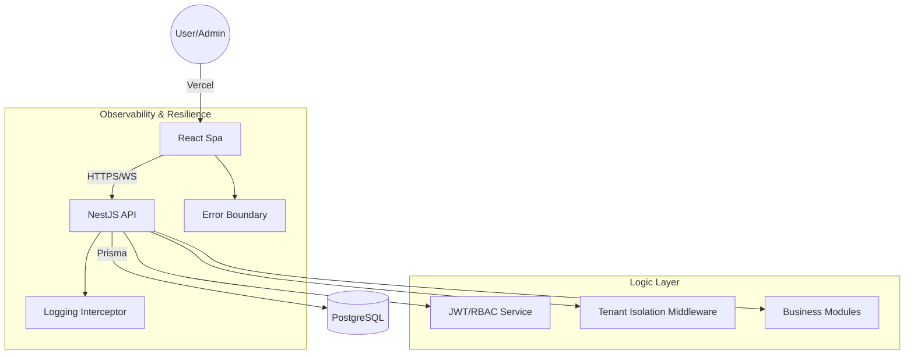

# Manajemen Pesantren SaaS Platform (APSS)

A modern, enterprise-ready Software as a Service (SaaS) platform designed for comprehensive Pesantren (Islamic Boarding School) management.

[](https://saas-manajemen-pesantren.vercel.app/)

## 🚀 Key Features

- **Multi-tenant Architecture**: Isolated data per pesantren (tenant) with customized configurations.
- **Enterprise-Grade Auth**: JWT-based authentication with secure HTTP-only Refresh Tokens.
- **RBAC (Role-Based Access Control)**: Granular permissions for Superadmins, Tenant Admins, Musyrif, and Operators.
- **Comprehensive Modules**:
  - **Academic Management**: Attendance, points, and reports.
  - **Financials**: Student payments, wallet system, and billing.
  - **Student Services**: Health tracking, visitation management (Kunjungan), and permission slips.
  - **Inventory**: Dormitory and school asset tracking.
- **Real-time Dashboard**: Interactive analytics and activity logs using Recharts.
- **Micro-animations**: Enhanced UX with `framer-motion` for a premium, alive feel.
- **Robustness**: Integrated Error Boundaries for graceful failure handling.

## 🛠️ Tech Stack

### Backend
- **Framework**: [NestJS](https://nestjs.com/) (Node.js)

- **Database**: PostgreSQL (hosted on Railway)

- **ORM**: Prisma

- **Real-time**: Socket.io / Native WebSockets

- **Tests**: Jest / Supertest

### Frontend
- **Framework**: [React](https://react.dev/) + TypeScript + Vite

- **Styling**: Vanilla CSS / CSS Modules

- **State Management**: React Hooks / Context API

- **Charts**: Recharts

- **Icons**: Lucide React

## 📐 Architecture Overview



## 🌟 Senior Portfolio Highlights

### 1. Backend Observability & Quality
- **Logging Interceptor**: Implemented a global interceptor in NestJS to track every HTTP request/response, improving production debugging and audit trails.
- **Comprehensive Testing**: 100% pass rate on core service unit tests, with a focus on robust authentication flows and tenant data isolation.

### 2. Frontend Visual Excellence
- **Modern Landing Page**: A fully responsive, dark-mode entry point with scroll animations.
- **Advanced UX**: Used `framer-motion` for micro-animations throughout the dashboard, creating a premium software experience.
- **Resilience**: A global React Error Boundary ensures that runtime errors display a professional fallback instead of a blank screen.

### 3. Clean Code Architecture
- **Tenant Isolation**: Strict logical separation of data using custom middleware and Prisma filters.
- **Modular Design**: Domain-driven project structure for both Backend and Frontend, ensuring high maintainability.

## 📦 Getting Started

### Prerequisites
- Node.js (v18+)
- PostgreSQL (or use the provided Railway instance)

### Installation

1. **Clone the repository**:
   ```bash
   git clone [repository-url]
   cd saas-manajemen-pesantren
   ```

2. **Backend Setup**:
   ```bash
   cd backend
   npm install
   cp .env.example .env # Configure your DB credentials
   npx prisma migrate dev
   npm run start:dev
   ```

3. **Frontend Setup**:
   ```bash
   cd ../frontend
   npm install
   npm run dev
   ```

---

*This project was developed with scalability and data isolation in mind, following best practices for modern SaaS applications.*
